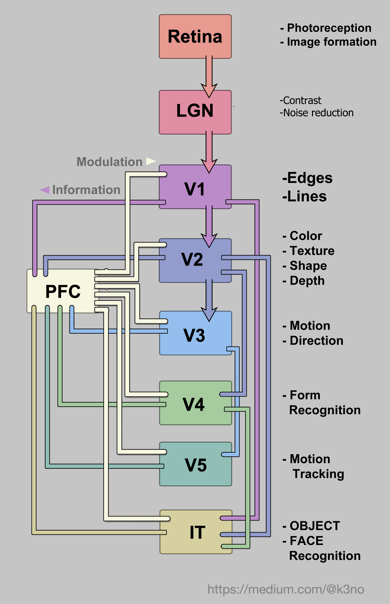

# Brain-Blueprints

## VISION SYSTEM

## AI COVERAGE

| Vision Area | Function | Implemented artificially? |
| --- | --- | --- |
| V1 | Primary visual processing, edge detection, orientation sensitivity | OpenCV, Canny Edge Detection algorithm |
| V2 | Form and color processing | Object Detection with deep learning models such as Faster R-CNN, YOLO  |
| V3 | Processing of visual motion and depth | Optical flow algorithm, Structure from motion |
| V4 | Color perception and form recognition | Deep Learning models for image classification, object detection |
| V5/MT | Visual motion processing | Optical flow algorithm, Hough Transform for detecting straight lines |
| IT | Object recognition and face recognition | Deep Learning models for object and face recognition |
| PFC | Attention, working memory and decision making related to vision | Attention-based models for visual recognition, Gaze tracking systems |

## PATHOLOGY

| Vision Area | Pathology |
| --- | --- |
| V1 (Primary Visual Cortex) | <ul><li>Damage can result in visual field defects, such as scotoma</li><li>Lesions in V1 can cause visual agnosia, a condition in which a person is unable to recognize objects despite having normal visual acuity</li></ul>|
| V2 (Secondary Visual Cortex) | <ul><li>Damage in V2 can lead to difficulty recognizing colors</li><li>Lesions in V2 can also cause a condition called Balint syndrome, which is characterized by difficulty with visual attention and pursuit, as well as difficulty with visually guided movement</li></ul>|
| V3 (Territory Visual Cortex)| <ul><li> Damage in V3 can lead to difficulty recognizing faces and form</li></ul>|
| V4 (Ventral Stream)| <ul><li> Damage in V4 can lead to difficulty recognizing colors and forms</li><li>Lesions in V4 can also cause a condition called apperceptive agnosia, a condition in which a person is unable to recognize objects despite having normal visual acuity</li></ul>|
| V5/MT (Motion Area)| <ul><li>Damage in V5/MT can lead to difficulty recognizing moving objects or tracking moving objects </li></ul>|
| LGN (Lateral Geniculate Nucleus) | <ul><li>Damage in LGN can result in visual field defects, such as scotoma</li><li>Lesions in LGN can cause visual agnosia, a condition in which a person is unable to recognize objects despite having normal visual acuity</li></ul>|
| PFC (Prefrontal Cortex) | <ul><li>Damage in PFC can lead to difficulty with attention, working memory and decision making processes that involve visual information</li></ul>|
